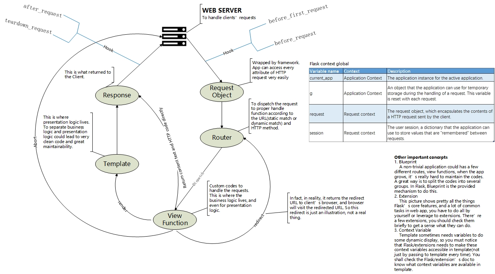

# Outline
* [目录](#outline)
* [书信息](#book-info)
* [源起](#how-come)
* [关于笔记](#about-notes)
* [我的总结](#my-summary)
* [笔记](#notes)

# book info
Flask Web Development
ISBN: 978-1-449-37262-0

# how come
我自己工作多年，最开始做算法策略，后来做大数据相关工作，对web开发没有什么经验。但是经常在工作中需要做一些小demo或者小工具，不得不写点非常小的web app，一直以来图快，就用CGI。

随着团队的扩大，常常被"鄙视"不懂web开发云云，实际上确是如此，我压根不知道web框架、模板、ORM这些都是什么东西，网上搜索查到的都比较零碎，所以打算找一本书系统地学习一下，但目的不在于自己成为web开发大神，而是完成从0到1的蜕变，实际用到的时候知道怎么查，怎么找，能够和web开发的同学们在基础层面上沟通无障碍。

关于书籍的选择，我最开始买了本《Python web开发实战》，但是鉴于我真的没有web开发经验，这本书对我而言实在高端，段落之间的起承转合个人感觉挺突兀，看了一半雾水满头，不适合我这种小白。再搜寻一番后，大家对于《Flask Web Development》比较推崇(循序渐进，层层递进)，且Flask这个框架非常小，适合我这种只需要完成web开发从0到1的选手。

这本书虽然有中文版，但我感觉有时候翻译可能难以完全体现原文意思，而且计算机相关技术书籍的词汇量并不大，我自己英文虽然不很好，但读原版书应该也差不多。主要还是追求原汁原味，避免翻译中丢失或曲解信息的可能。

再然后就是自己开始读这本书。说实话，一个人读书还是很孤独的，经常会倦，特别是精神状态不是很好的时候，读着读着虽然翻了很多页，但感觉啥也没进脑子。这时候就决定开始记笔记，读的时候的理解、任何想法都记下来，感觉就不是一个人在读书了，不会很无聊。再往后，把带笔记的书借给其他同学看的时候，大家都觉得比自己看没笔记的裸书效果更好。所以我觉得可以把这些笔记分享出来，希望对跟我有同样诉求的人有些许帮助。

# about notes
我的目的主要还是理解web开发框架以及Flask这个框架，所以这本书虽然我读完了，但是笔记只针对第一部分(1~7章)，后面是结合一个实际web应用的实践(实际上介绍了很多Flask的扩展)。只要第一部分透彻了，第二、三部分其实过一遍，实际用到的时候再查官方文档就够了，应该不会出现挡手的情况。

# my summary

在读完整本书以后，我总结了下Flask的核心，大概是下面这张图：

> 我读英文还行，写英文比较烂，但上图我还是用英文写了，错漏支出请指正。

因为一个web应用抽象起来就是：
1. 拿到用户的请求
2. 根据请求进行各种业务逻辑代码的编写
3. 组装返回的响应

Flask最朴素的核心就是帮我们：
1. 把用户请求封装成一个好用的"request"对象
2. 根据URL规则，把请求转发给不同的处理函数(路由)
3. 帮忙定义好基本的处理函数，我们只需要填业务代码

至于模板(Template)都属于进一步的功能了。

# notes
每条笔记都进行了编号，以方便查阅，编号规则是"*页码*-*该页内笔记序号*"。

## xii-1
路径: Preface / Who This Book Is For
页码: xii
原文:
> You should have some level of Python coding experience to make the most of this book. Although the book assumes no previous Flask Knowledge, Python concepts such as packages, modules, functions, decorators, and object-oriented programming are assumed to be well understood.

笔记: 
这里直接就说需要有基本的Python知识，不过很多Python的使用者都不清楚*packages*, *modules*, *decorators*，*OO*的话现在几乎所有的主流编程语言都有，问题应该不大。然后还需要知道的就是[相对导入](https://docs.python.org/2.5/whatsnew/pep-328.html)。

- module —— 一个'*.py*'文件就是一个module
- package —— 一个路径下，里面有一个'*\_\_init\_\_.py*'，那么该文件夹下的'*.py*'文件共同组织成一个包(package)，主要是用于组织代码的
- decorator —— 这个其实可以很复杂，但简单来说它就是一个函数，只是它的主要参数也是一个函数，返回值也是一个函数，可以认为它是对函数的进一步加工，额外增加了一些功能，即"装饰"了原函数。和Java里面的面向切面的编程应该是同一个概念。**不过对于阅读本书，把它看成一个特殊语法就行了，不一定要深入理解这个概念**。
- relative import —— 相对导入非常实用，特别是对于稍微大一点的项目，只需要知道相对路径即可导入，它有两个小要点：
	- 必须使用`from`进行导入，不能直接`import`
	- 以`.`作为开始，如`from . import A` 表示在当前路径下导入模块A, `from .. import B`表示在上一层目录下导入模块B，`from ..B import C`表示在上一层目录下导入B的C

另外就是，web开发不可避免的还有： 

- JavaScript 
	本书完全没有涉及，所以也不需要有太多的关于JavaScript的先验知识
- CSS 
	知道它是用来控制网页展现样式的差不多就行了，然后大概知道bootstrap是个啥概念就行，也不需要有什么特别多的先验知识
- HTML 
	这个也只需要有浅显的了解就行


## 3-1
路径: Part I. Introduction to Flask/Chapter 1. Installation
页码: 3
原文:
> It is small enough that once you become familiar with it, you will likely be able to read and understand all of its source code.

笔记:
我把Part I读了两遍，但还没有实际写过什么Flask应用，不过从目前的状态看，如果去读Flask源码的话应该没什么问题。实际上只要理解了Web开发的基本逻辑，看懂Flask源码的难度应该就不大。


## 7-1
路径: Part I. Introduction to Flask/Chapter 2. Basic Application Structure
页码: 7
原文:
> The `name` argument that is passed to the Flask application constructor is a source of confusion among new Flask developers. Flask uses this argument to determine the root path of the application so that it later can find resource files relative to the location of the application.

笔记:
这个确实非常难受，而且费解，在了解原因之前，靠死记还是挺难的。

## 9-1
路径: Part I. Introduction to Flask / Chapter 2. Basic Application Structure / Server Startup
页码: 9
原文:
> The application instance has a run method that launches Flask's integrated development web server

笔记:
这个内置的web server仅仅是用于开发环境，并不应该用于生产环境。在生产环境里，应该使用Gunicore或者gWSGI来作为web server，甚至在它们之前搭个Nginx来做反向代理。不过这些对于学习本书而言暂时不是很重要，只是需要记住，不要在正式产品中直接用Flask自带的web server就行了。

## 13-1
路径: Part I. Introduction to Flask / Chapter 2. Basic Application Structure / The Request-Response Cycle / Application and Request Contexts
页码: 13
原文:
> Note how in this view function `request` is used as if it was a global variable. In reality, `request` cannot be a global variable if you consider that in a multithreaded server the threads are working on different requests from different clients at the same time, so each thread needs to see a different object in `request`. Context enable Flask to make certain variables globally accessible to a thread without interfering with the other threads.

笔记:
这个`request`实在是很惊艳，使得应用代码非常简单。看上去是全局变量，但实际上对于每一个处理线程都是独立的。而且因为看上去是全局变量，进而使得不用到处去传`request`对象，因此它被称作“**上下文变量**”。
这个**上下文变量**真是神奇，这背后实际上是Flask的一个有趣的实现。而且这个实现并不特别复杂，但是现在咱们可以不用太关注它的实现。


## 13-2
路径: Part I. Introduction to Flask / Chapter 2. Basic Application Structure / The Request-Response Cycle / Application and Request Contexts
页码: 13
原文:
> A thread is the smallest sequence of instructions that can be managed independently. It is common for a process to have multiple active threads, sometimes sharing resources such as memory or file handles. Multithreaded web servers start a pool of threads and select a thread from the pool to hanle each incoming request.

笔记:
实际上多线程web服务器是维护了一个线程池来处理请求的，而不是每来一个请求就创建一个线程。


## 15-1
路径: Part I. Introduction to Flask / Chapter 2. Basic Application Structure / The Request-Response Cycle / Request Hooks
页码: 15
原文:
> A common pattern to share data between request hook functions and view functions is to use the `g` context global. For example, a `before_request` handler can load the logged-in user from the database and store it in `g.user`. Later, when the view function is invoked, it can access the user from there.

笔记:
这个例子实际上是说，如果用户已经登录了，那么可以在正式处理当前请求前把该用户的相关信息从数据库里面取出来备用，而不是在多个view function里面进行各自加载。


## 16-1
路径: Part I. Introduction to Flask / Chapter 2. Basic Application Structure / The Request-Response Cycle / Responses
页码: 16
原文:
> Note that `abort` does not return control back to the function that calls it but gives control back to the web server by raising an exception.

笔记:
这个和一般的响应其实不太一样，它"简单粗暴"地直接向web server扔出一个exception。


## 17-1
路径: Part I. Introduction to Flask / Chapter 2. Basic Application Structure / Flask Extensions / Command-Line Options with Flask-Script
页码: 17
原文:
> *Example 2-3. hello.py: Using Flask-Script*
> ```
> from flask.ext.script import Manager
> manager = Manager(app)
> 
> # ...
> 
> if __name__ == '__main__':
>     manager.run()
> ```

笔记:
根据最新的标准，导入Flask扩展的时候应该使用`from flask_script import Manager`，避免使用`flask.ext.xxx`这种方式。


## 19-1
路径: Part I. Introduction to Flask / Chapter 2. Basic Application Structure / Flask Extensions 
页码: 19
原文:
笔记:
整个"Flask Extensions"一节，主要就是show了一下*flask-script*这个扩展，没有阐述扩展的原理之类的。得到的感觉就是，Flask可以通过扩展干很多事情。书中第二部分会有不少扩展相关的使用。离开扩展，Flask用起来要造挺多轮子的。


## 21-1
路径: Part I. Introduction to Flask / Chapter 3. Templates
页码: 21
原文:
> The obvious task of a view function is to generate a response to a request, as you have seen in the examples shown in Chapter 2. For the simplest requests this is enough, but in general a request triggers a change in the state of the application, and the view function is also where this change is generated.
>
> For example, consider a user who is registering a new account on a website. The user types an email address and a password in a web form and clicks the Submit button. On the server, a request that includes the data from the user arrives and Flask dispatchea it to the view function that handles registration requests. This view function needs to talk to the database to get the new user added and then generate a response to send back to the browser. These two types of tasks are formally called *bussiness logic* and *presentation logic*, respectively.
>
> Mixing bussiness and presentation logic leads to code that is hard to understand and maintain. Imagine having to build the HTML code for a large table by concatenating data obtained from the database with the necessary HTML string string literals. Moving the presentation logic into *templates* helps improve the maintainability of the application.

笔记:
其实从功能上说，模板并不是必要的核心功能，但是使用模板可以很好的将业务逻辑和展现逻辑分开，使得代码的可读性、可维护性更好。不过这本身也带来了额外的学习成本——学习模板语言，幸好它并不难。
另外我感觉，最开始，Flask并没有考虑拆分业务逻辑和展现逻辑？因为它把处理请求的函数称为"view function"(视图函数)嘛，所以最开始Flask并没有使用模板？所有的东西直接在view function中完成。不然的话，视图函数这个称呼还是挺迷惑的，哈哈哈。


## 26-1
路径: Part I. Introduction to Flask / Chapter 3. Templates / Twitter Bootstrap Integration with Flask-Bootstrap
页码: 26
原文:
> Once Flask-Bootstrap is initialized, a base template that includes all the Bootstrap files is available to the application.

笔记:
注意到，只要是扩展就一定要被初始化，否则就没法用。我一开始想，bootstrap就是一坨css之类的东西，而且是在模板里面用的，所以就没有初始化它，结果报找不到模板文件。后来才发现原来是我没有在应用代码里面初始化这个插件(`bootstrap = Bootstrap(app)`)。


## 29-1
路径: Part I. Introduction to Flask / Chapter 3. Templates / Custom Error Pages
页码: 29
原文:
> *templates/404.html*, and *templates/500.html*

笔记:
小脑洞，这俩template其实可以合并成一个，view function把'404'或者'500'传过来就行。不过这种方式对于不同错误号展现不同样式而言，会使得模板文件比较复杂。所以，可能还是俩模板文件比较合理。


## 33-1
路径: Part I. Introduction to Flask / Chapter 3. Templates / Static Files
页码: 33
原文:
> *Example 3-10. templates/base.html: favicon definition*
> ```
> {{ super() }}
> < link rel="shortcut icon" href="{{url_for('static', filename = 'favicon.ico') }}" type="image/x-ico"\>
> 
> < link rel="icon" href="{{url_for('static', filename = 'favicon.ico') }}" type="image/x-ico"\>
> 
> ```

笔记:
为啥`url_for`可以在Jinja2的模板里面使用啊？它不是一个Flask的函数么？
这个是Flask的一个被称为[标准上下文(standard context)](http://flask.pocoo.org/docs/0.12/templating/#standard-context)的东西。Flask默认会把一些函数、变量在Jinja2模板里面可用。而一些扩展也会做类似的事情，比如用户登录的扩展，会把当前用户变量(current_user)在模板中可用，这样模板里面可以直接拿到当前用户的数据，比在view function里面传要方便很多。


## 37-1
路径: Part I. Introduction to Flask / Chapter 4. Web Forms
页码: 37
原文:
> Although the support provided in Flask's request object is sufficient for the handling of web forms, there are a number of tasks that can become tedious and repetitive. Two good examples are the generation of HTML code for forms and the validation of the submitted form data.

笔记:
这段其实蛮重要的，否则看到后面可能会想为什么又要搞什么*flask-wtf*，干嘛又引入这么多乱七八糟的东西，不知道为啥。
脑子里有明确的方向或者问题，才能有的放矢，才知道后面写的东西是想要干嘛。


## 38-1
路径: Part I. Introduction to Flask / Chapter 4. Web Forms / Form Classes
页码: 38
原文:
> *Example 4-2. hello.py: Form class definition*
> ```from flask.ext.wtf import Form```

笔记:
这个现在应该是`from flask_wtf import FlaskForm`


## 40-1
路径: Part I. Introduction to Flask / Chapter 4. Web Forms / HTML Rendering of Forms
页码: 40
原文:
> Form fields are callables that, when invoked, from a template render themselves to HTML.

笔记:
如果一个表单字段在模板里面没有被调用，那么它就不会展现在最终的HTML页面里。
虽然表单字段是可调用的，但是它们仍然有一些可用的属性。
我感觉，它们如果有一个方法叫`render`之类的，而不是直接调用它们自己，可能更好理解。


## 41-1
路径: Part I. Introduction to Flask / Chapter 4. Web Forms / Form Handling in View Functions
页码: 41
原文:
> *Example 4-4. hello.py: Route methods*
>
> ```Python
> @app.route('/', methods=['GET', 'POST'])
> def index():
>     name = None
>     form = NameForm()
>     if form.validate_on_submit():
>         name = form.name.data
>         form.name.data = ''
>     return render_tempalte('index.html', form=form, name=name)
> ```

笔记:
第一次看这段代码会很迷惑。变量`form`是刚刚创建的对象(而且创建时没有传任何参数)，里面应该是空的啊，怎么会validate成功，且使用它里面的数据呢？
其实，想了一下，书前面已经说了，Flask把当前`request`搞的跟全局变量一样，那么`NameForm`(实际上是`flask_wtf.FlaskForm`)在初始化的时候当然也能访问`request`对象啊，自然可以"默不作声"地从`request`把表单数据拿出来初始化自己。所以，当提交表单的时候，`NameForm()`执行完以后，`form`里自然已经有数据了哦。


## 42-1
路径: Part I. Introduction to Flask / Chapter 4. Web Forms / Form Handling in View Functions
页码: 42
原文:
> When the form is submitted by the user, the server receives a POST request with the data. The call to `validate_on_submit()` invokes the `Required()` validator attached to the *name* field. If the *name* is not empty, then the validator accepts it and `validate_on_submit()` returns True.

笔记:
从这段看，所有的校验都是在服务器端做的，但是现在咱们试验的时候，发现提交空表单的时候浏览器压根不会发送任何请求，直接就报不能为空。看下页面源码，发现*< input>*元素里多了一个*required*属性。这说明，*flask_wtf*在本书成书到现在已经升级了，对于某些检验，会放在客户端做，比如这种非空检验。
再往后看Figure 4-3，如果我们在浏览器里把*required*属性去掉，呈现的效果就跟该图一样了。


## 44-1
路径: Part I. Introduction to Flask / Chapter 4. Web Forms / Redirects and User Sessions
页码: 44
原文:
> A redirect is a special type of response that has a URL instead of a string with HTML code. When the browser receives this response, it issues a GET request for the redirect URL, and that is the page that is displayed. The page may take a few more milliseconds to load because of the second request that has to be sent to the server, but other than that, the user will not see any difference. Now the last request is a GET, so the refresh command works as expected. This trick is known as the Post/Redirect/Get pattern.

笔记:
这段描述了一个挺不错的Web模式。
另一个值得我们注意的是，整个*redirect*(重定向)涉及了服务器端和客户端。在Flask框架逻辑上，似乎重定向只涉及到服务器端(从一个view function转到另一个view function)，但实际上是服务器端向客户端发了一个响应要求重定向，然后客户端再重新发一个请求给服务器端。


## 45-1
路径: Part I. Introduction to Flask / Chapter 4. Web Forms / Redirects and User Sessions
页码: 45
原文:
> By default, user sessions are stored in client-side cookies that are cryptographically signed using the configured SECRET_KEY. Any tampering with the cookie content would render the signature invalid, thus invalidating the session.

笔记:
在客户端存储*session*可能是一个重要的概念。这种方式对于服务器端没有任何额外的负载。


## 45-2
路径: Part I. Introduction to Flask / Chapter 4. Web Forms / Redirects and User Sessions
页码: 45
原文:
> By default, the endpoint of a route is the name of the view function attached to it.

笔记:
*endpoint*这个概念在Flask里面是一个核心概念，它是view function的名字，这一句话很重要。`url_for`的入口参数主要就是*endpoint*.


## 47-1
路径: Part I. Introduction to Flask / Chapter 4. Web Forms / Message Flashing
页码: 47
原文:
> Flask makes a `get_flashed_messages()` function available to templates to receive the message and render them, as shown in Example 4-7.

笔记:
这里再次回顾一下[标准上下文(standard context)](http://flask.pocoo.org/docs/0.12/templating/#standard-context)的概念。


## 52-1
路径: Part I. Introduction to Flask / Chapter 5. Databases / Database Management with Flask-SQLAlchemy
页码: 52
原文:
> It offers a high-level ORM and low level access to the database's native SQL functionality.

笔记:
也可以有底层的SQL访问，这个可能对于性能要求较高的SQL语句比较合适，毕竟ORM自动生成的SQL语句性能上可能不会很好？不过混用可能也很麻烦。


## 53-1
路径: Part I. Introduction to Flask / Chapter 5. Databases / Database Management with Flask-SQLAlchemy
页码: 53
原文:
> *Example 5-1. hello.py: Database configuration*
> ```
> app.config['SQLALCHEMY_COMMIT_ON_TEARDOWN'] = True
> ```

笔记:
根据flask-sqlalchemy官方文档，从v2.0版本开始，*SQLALCHEMY_COMMIT_ON_TEARDOWN*配置被认为是有害的，并且已经从使用文档中删除了。所以在实际应用的时候，我们不应该使用它。当需要进行数据库的commit操作时，应该显示地进行commit。


## 56-1
路径: Part I. Introduction to Flask / Chapter 5. Databases / Relationships
页码: 56
原文:
> The `backref` argument to `db.relationship()` defines the reverse direction of the relationship by adding a `role` attribute to the `User` model. This attribute can be used instead of `role_id` to access the `Role` model as an object instead of as a foreign key.

笔记:
我大概知道ORM的概念，但是这段描述的我感觉已经有点高级了。即`Role` class中调用`db.relationship`，使用`backref`这个参数会在`User`这个class里面增加一个属性`role`，而且我们不需要显式地用`role_id`来自己去*join*拿到它的角色信息。这个我感觉算是ORM的一种语法糖之类的？总之，我觉得这个似乎很好用，但是不知道会不会影响性能。


## 57-1
路径: Part I. Introduction to Flask / Chapter 5. Databases / Relationships
页码: 57
原文:
> *Table 5-4.* Common SQLAlchemy relationship options

笔记:
这个表，关于`lazy`参数的解释并不是完全理解，不过似乎影响不怎么大。不过这里面有一个英文有点绕:
>**dynamic**(instead of loading the items the query that can load them is given).

这是说，如果`lazy`设置成了`dynamic`，那么实际上是不会加载数据的，而是返回一个可以加载这些数据的查询对象(query)。之所以返回query，是因为可以继续添加额外的限定条件，而不至于加载业务上可能不需要的数据，进而影响性能，这个在后面也有说。第一次看这句话的时候也没能理解，看到后面才知道是啥。


## 58-1
路径: Part I. Introduction to Flask / Chapter 5. Databases / Database Operations / Creating the Tables
页码: 58
原文:
> ```
> (venv) $ python hello.py shell
> >>> from hello import db
> >>> db.create_all() 
> ```

笔记:
一开始我没有完全按照书上的走，一直还是用的`app.run()`来运行程序，导致这段命令怎么也不行。然后自己捣鼓了后，发现可以这么干：
在Windows 10上，用自带的"CMD"也可以使用下面的命令运行:
```
set FLASK_APP=.\hello.py
python shell
```
不过最好还是能有一个Linux环境，比较方便。我自己懒得搞Linux环境，用Git Bash + Windows 10自带的"CMD"来搞。一般是下载代码、看代码、修改代码、安装包的时候用Git Bash，运行的时候用Windows的"CMD"。

不过如果严格跟着书上走，使用`manager.run()`来启动程序，在Windows 10上的"CMD"中也可按照书上这段命令来执行的。
看书稍微有点不注意，就有各种小闹心出来，也是够了。


## 58-2
路径: Part I. Introduction to Flask / Chapter 5. Databases / Database Operations / Inserting Rows
页码: 58
原文:
> Note that even the `role` attribute can be used, even though it is not a real database column but a high-level representation of the one-to-many relationship.

笔记:
这里说的是，其实数据库里面的User表压根没有`role`这个字段，但是在高层表示(即User对象)中是有这个属性的，而这个属性是ORM引擎自动帮我们填充的，以便我们使用。
这么看，一但底层数据表、模型定义好了以后，写业务逻辑代码的时候面向的就直接是各个对象了，用起来挺方便的。不过这个是不是会有一些性能开销？


## 60-1
路径: Part I. Introduction to Flask / Chapter 5. Databases / Database Operations / Querying Rows
页码: 60
原文:
> ```>>> str(User.query.filter_by(role=user_role))
> 
> 'SELECT users.id AS users_id, users.username AS users_username,
> users.role_id AS users_role_id FROM users where :param_1 = users.role_id'
> ```

笔记:
这个可以把转换的SQL语句打印出来，在debug的时候应该很有用。


## 63-1
路径: Part I. Introduction to Flask / Chapter 5. Databases / Integration with the Python Shell
页码: 63
原文:
笔记:
这一节我其实不是很理解必要性，因为我没有实际做项目进行debug的经验，所以对我来说现在不是很必要，可能在实际开发debug的时候这点很有用？


## 65-1
路径: Part I. Introduction to Flask / Chapter 5. Databases / Database Migrations with Flask-Migrate / Creating a Migration Repository
页码: 65
原文:
>```
>(venv) $ python hello.py db init
Creating directory /home/flask/flasky/migrations...done
Creating directory /home/flask/flasky/migrations/versions...done
Generating /home/flask/flasky/migrations/alembic.ini...done
Generating /home/flask/flasky/migrations/env.py...done
Generating /home/flask/flasky/migrations/env.pyc...done
Generating /home/flask/flasky/migrations/README...done
Generating /home/flask/flasky/migrations/script.py.mako...done
Please edit configuration/connection/logging settings in
'/home/flask/flasky/migrations/alembic.ini' before proceeding.
>```

笔记:
我在运行的时候有这样的警告：

*UserWarning: SQLALCHEMY_TRACK_MODIFICATIONS adds significant overhead and will be disabled by default in the future.  Set it to True to suppress this warning.
*
所以现在应该需要把这个选项设成"True"。不过暂时可能不太需要细究？确实用到的时候再check官方文档。


## 65-2
路径: Part I. Introduction to Flask / Chapter 5. Databases / Database Migrations with Flask-Migrate / Creating a Migration Repository
页码: 65
原文:
> The files in a database migration repository must always be added to version control along with the rest of the application.

笔记:
其实migration的原理就是跟踪model的修改，然后生成相对应的数据库修改代码，然后执行。所以这些修改代码本质上也是我们开发的程序代码的一部分，只不过它们不是我们手敲的，而是通过flask-migrate这个扩展自动生成的。所以呢，它们当然也需要加到代码库里面。


## 66-1
路径: Part I. Introduction to Flask / Chapter 5. Databases / Database Migrations with Flask-Migrate / Creating a Migration Script
页码: 66
原文:
> Automatic migrations are not always accurate and can miss some details. Migration scripts generated automatically should always be reviewed.

笔记:
按照这个说法，flask-migrate只能尽最大可能帮助我们自动跟踪model的变化，但无法100%保证正确。所以，每次做migrate的时候一定要小心check下。不过话说回来，如果真的出现了错误的情况，要怎么办？自己修改生成的代码么？


## 70-1
路径: Part I. Introduction to Flask / Chapter 6. Email / Email Support with Flask-Mail
页码: 70
原文:
> *Example 6-1. hello.py:* Flask-Mail configuration for Gmail
> ```import os
> \ # ...
> 
> app.config['MAIL_SERVER'] = 'smtp.googlemail.com'
> app.config['MAIL_PORT'] = 587
> app.config['MAIL_USE_TLS'] = True
> app.config['MAIL_USERNAME'] = os.environ.get('MAIL_USERNAME')
> app.config['MAIL_PASSWORD'] = os.environ.get('MAIL_PASSWORD')
> ```

笔记:
使用环境变量传递一些敏感信息看上去是一个挺好的办法，比写在代码里面或者配置里面好太多。


## 78-1
路径: Part I. Introduction to Flask / Chapter 7. Large Application Structure / Application Package / Using an Application Factory
页码: 78
原文:
笔记:
这一节整体在说我们不能直接启动程序了，因为这个程序有不同的配置，在启动的时候需要根据不同的配置实例化程序。所以我们需要一个所谓的工厂方法来根据不同的配置实例化应用程序。


## 79-1
路径: Part I. Introduction to Flask / Chapter 7. Large Application Structure / Application Package / Implementing Application Functionality in a Blueprint
页码: 79
原文:
> The conversion to an application factory introduces a complication for routes. In single-script applications, the application instance exists in the global scope, so routes can be easily defined using the `app.route` decorator. But now that the application is created at runtime, the `app.route` decorator begins to exist only after `create_app()` is invoked, which is too late. Like routes, custom error page handlers present the same problem, as these are defined with the `app.errorhandler` decorator.

笔记:
这段其实值得多读两遍。
在单文件应用里，`app`是直接被初始化了，所以`app.route`这个装饰器是直接可以用的，这个装饰器在程序加载的时候就会执行(把*endpoint*和URL对应关系放到路由里面去)。但是现在的程序结构，一开始并没有`app`这个对象，当然也就没办法使用`app.route`了。
从这个问题，后面就引出了关于**Blueprint**的介绍，所以blueprint的主要目的还是用于组织代码的。


## 80-1
路径: Part I. Introduction to Flask / Chapter 7. Large Application Structure / Application Package / Implementing Application Functionality in a Blueprint
页码: 80
原文:
> Importing these modules causes the routes and error handlers to be associated with the blueprint.

笔记:
这句话说，导入这些模块就使得路由(*routes*)和错误处理函数(*error handlers*)跟当前蓝图(*blueprint*)就联系起来了。但是这是为什么？？？
其实这是因为装饰器机制导致的，我们看一个非常简单的例子：
a.py:
```
def mydecorator(f):
    print 'decorate!'
    return f

@mydecorator
def myfunc():
    print 'myfunc'
```
b.py:
```
import a
```
我们在命令行中测试：
```
$ python a.py
decorate!
$ python b.py
decorate!
```
Python有一个特性是：代码在被加载时，所有的顶级代码(没有缩进的)都会被执行，而这里的装饰器实际上是生成了`myfunc = mydecorator(myfunc)`这么个语句，且因为是顶级代码，所以会被执行。

所以回到书里，一旦被import，路由、错误处理函数这些装饰器都会执行(装饰器代码执行，并不是被装饰的函数执行)，即使得路由、错误处理函数跟蓝图联系起来了。


## 80-2
路径: Part I. Introduction to Flask / Chapter 7. Large Application Structure / Application Package / Implementing Application Functionality in a Blueprint
页码: 80
原文:
> A difference when writing error handlers inside a blueprint is that if the `errorhandler` decorator is used, the handler will only be invoked for errors that originate in the blueprint. To install application-wide error handlers, the `app_errorhandler` must be used instead.
 
笔记:
这个我猜最初写Flask的时候没有Blueprint，然后发展着增加了Blueprint这么个东西，但是为了内部代码和逻辑的一致，就没有改`errorhandler`的逻辑，而是新增了`app_errorhandler`。


## 81-1
路径: Part I. Introduction to Flask / Chapter 7. Large Application Structure / Application Package / Implementing Application Functionality in a Blueprint
页码: 81
原文:
> The difference with blueprints is that Flask applies a namespace to all the endpoints coming from a blueprint so that multiple blueprints can define view functions with the same endpoint names without collisions. The namespace is the name of the Blueprint(the first argument to the *Blueprint* constructor), so the *index()* view function is registered with endpoint name *main.index* and its URL can be obtained with *url_for('main.index')*.

笔记:
如果前面没有错过对*endpoint*这个概念的解释，那么这段就没什么难的。*endpoint*其实就是view function的函数名。


## 82-1
路径: Part I. Introduction to Flask / Chapter 7. Large Application Structure / Launch Script
页码: 82
原文:
> *Example 7-8. manage.py*: Launch script
> ```
> #!/usr/bin/env python
import os
from app import create_app, db
from app.models import User, Role
from flask.ext.script import Manager, Shell
from flask.ext.migrate import Migrate, MigrateCommand
>
app = create_app(os.getenv('FLASK_CONFIG') or 'default')
manager = Manager(app)
migrate = Migrate(app, db)
>
def make_shell_context():
>    return dict(app=app, db=db, User=User, Role=Role)
>manager.add_command("shell", Shell(make_context=make_shell_context))
>manager.add_command('db', MigrateCommand)
>
>if __name__ == '__main__':
>    manager.run()
>```

笔记:
这个命令行相关的扩展在*manage.py*中初始化，而其他和应用程序功能相关的扩展则在应用程序自身的代码中初始化，这样的组织应该是比较合理的。书后面第二部分还会出现在某个blueprint中初始化的扩展。
